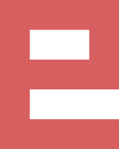

e - a text editor
=================

*e* will be a text editor written in C. It'll follow a transparent client-server
to allow concurrent editing of the same file(s). tree-sitter will be used for 
syntax highlighting and basic code analysis.

*e* isn't ready for use (or even testing) yet.

## ToDo

- [x] rope data structure
- [x] range/cursor handling
- [ ] command framework (do/undo)
- [ ] socket protocol (json/bjson?)
- [ ] daemon lifecycle
- [ ] tree-sitter integration
- [ ] command line frontend
- [ ] vt100 frontend

### Concepts

- e-editor
  - **0-n** buffers representing opened files
    - **0-n** buffer editors
      - undo/redo stack
      - **0-n** cursors
        - cursor position
        - edit actions

